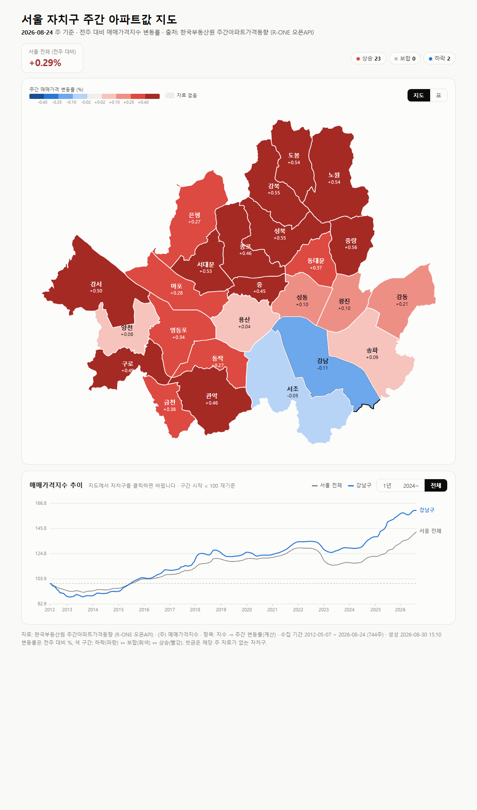

# apt-baro-map — 서울 자치구 주간 아파트값 지도

한국부동산원 **주간아파트가격동향**(R-ONE 오픈API)의 매매가격지수를
서울 25개 자치구 choropleth 지도 + 장기 시계열 차트로 보여주는 정적 페이지입니다.

**→ https://apt-baro-map.vercel.app/**



## 사용 방법

### 1. 인증키 발급 (최초 1회)
[R-ONE 부동산통계정보시스템 Open API](https://www.reb.or.kr/r-one/portal/openapi/openApiIntroPage.do)
에서 회원가입 후 인증키를 발급받습니다.
(공공데이터포털의 [한국부동산원_부동산통계 조회 서비스](https://www.data.go.kr/data/15134761/openapi.do)와 같은 API입니다.)

### 2. 키 설정
프로젝트 루트에 `.env` 파일을 만들고:

```
RONE_API_KEY=발급받은키
```

### 3. 데이터 수집
```
python scripts/fetch_data.py
```
- **첫 실행**은 2012년부터의 전체 주간 이력을 연도별로 받아 `data/history.json`에 캐시합니다
  (약 17만 행, 수 분 소요). 연도마다 저장하므로 중간에 끊겨도 다시 실행하면 이어받습니다.
- **이후 실행**은 저장된 마지막 주 이후만 증분 수신하므로 몇 초면 끝납니다.
  매주 목요일(부동산원 공표일) 이후 다시 실행하면 최신 주가 반영됩니다.
- 결과는 `data/latest.js` / `data/latest.json` 에 저장됩니다.

주요 옵션:

| 옵션 | 설명 |
|---|---|
| `--list` | 주간(WK) 주기 통계표 후보 목록 출력 |
| `--statbl-id T244183132827305` | 통계표 직접 지정 (기본값은 자동 선택 후 `data/config.json`에 캐시) |
| `--since 2024-01-01` | 화면에 담을 기간 제한 (기본: 전체 이력) |
| `--full` | 캐시를 버리고 전체 이력 재수신 |

### 4. 지도 열기
`index.html` 을 브라우저로 열면 됩니다 (로컬 서버 불필요).
키 설정 전에는 샘플 데이터로 렌더링되며, 상단에 샘플 안내 배너가 표시됩니다.

## 화면 구성

**지도** — 자치구별 최신 주간 변동률
- 색: 하락(파랑) ↔ 보합 ±0.02%p(회색) ↔ 상승(빨강), 구간별 4단계 diverging ramp
- 빗금: 해당 주 자료가 없는 자치구
- 마우스를 올리면 최근 1년 스파크라인 + 최근 8주 변동률 툴팁
- 우측 상단 "표" 버튼으로 전체 자치구 표 보기 전환

**시계열 차트** — 매매가격지수 추이
- 지도에서 자치구를 클릭하면 해당 구가 서울 전체와 비교되어 표시됩니다 (다시 클릭하면 해제)
- 기간: 1년 / 2024~ / 전체(2012~), 구간 시작 시점을 100으로 재기준
- 크로스헤어 + 툴팁으로 주별 값 확인

**URL 해시로 상태 공유** — `index.html#강남구,all` 처럼 자치구와 기간을 지정해 링크할 수 있습니다.

## 배포 (Vercel)

빌드가 없는 정적 사이트라 리포 루트가 그대로 서빙됩니다. `main` 에 푸시하면
Vercel이 1분 안에 배포합니다. 설정은 [vercel.json](vercel.json) 한 파일이 전부입니다.

```
python scripts/fetch_data.py          # 최신 주 반영
git add data/ && git commit -m "데이터 갱신: YYYY-MM-DD 주" && git push
```

최초 연결: [vercel.com/new](https://vercel.com/new) 에서 이 리포를 import →
Framework Preset `Other`, Build Command 없음, Output Directory 루트(`.`) → Deploy.
환경 변수는 필요 없습니다(데이터 수집은 로컬에서만 실행하고 결과를 커밋합니다).

## 분석 (Google Analytics 4)

사이트마다 **별도 GA4 속성**을 쓰고, 리포당 측정 ID는 한 곳에서만 관리합니다.

| 항목 | 이 리포에서 |
|---|---|
| 측정 ID 위치 | [config.js](config.js) 의 `window.GA_MEASUREMENT_ID` |
| 로더 | [analytics.js](analytics.js) — 5개 사이트 공통 파일 |
| 미설정 시 | gtag를 아예 로드하지 않고 사이트는 그대로 동작 |
| 집계 제외 | `file://`, `localhost` |
| 이벤트 API | `window.gaEvent(name, params)` / `window.gaPageView(path)` |

측정 ID는 Google Analytics > 관리 > 데이터 스트림에서 확인합니다 (`G-` 로 시작).
`config.js` 에 넣고 커밋·푸시하면 배포에 반영됩니다.

> 측정 ID는 모든 방문자의 브라우저에 노출되는 **공개 식별자**라 비밀값이 아니고,
> 정적 파일로 서빙돼야 하므로 커밋 대상입니다. 반면 R-ONE 인증키(`RONE_API_KEY`)는
> 데이터 수집 스크립트 전용이라 `.env` 에만 두고 프런트엔드로 내보내지 않습니다.

기본 페이지뷰 외에 이 사이트가 보내는 이벤트:

| 이벤트 | 발생 시점 | 파라미터 |
|---|---|---|
| `select_district` | 지도에서 자치구 선택 | `district`, `week` |
| `change_range` | 차트 기간 변경 | `range` (`1y`/`2024`/`all`) |
| `change_view` | 지도 ↔ 표 전환 | `view` (`map`/`table`) |

## 파일 구성

| 파일 | 역할 |
|---|---|
| `index.html` | 지도 페이지 (SVG choropleth + 시계열 차트, 툴팁, 범례, 표 보기) |
| `config.js` | 사이트 설정 (GA4 측정 ID) — 브라우저가 읽으므로 커밋 대상 |
| `analytics.js` | GA4 로더 (5개 사이트 공통 규격) |
| `vercel.json` | 배포 설정 (정적 서빙 + 캐시 헤더) |
| `.env` | API 인증키 등 비공개 값 — 커밋되지 않음 |
| `scripts/fetch_data.py` | R-ONE API 호출 → `data/latest.js` 생성 (표준 라이브러리만 사용) |
| `data/seoul_geo.js` | 서울 자치구 경계 ([southkorea/seoul-maps](https://github.com/southkorea/seoul-maps) 간략화판) |
| `data/history.json` | 전체 주간 이력 캐시 (증분 수신의 기준) |
| `data/latest.js` | 화면이 읽는 데이터 (변동률 + 지수 원값) |
| `data/config.json` | 선택된 통계표 ID 캐시 |

## 데이터 관련 참고

- 사용 통계표는 `(주) 매매가격지수` (`T244183132827305`)로, **지수만 제공**하므로
  주간 변동률은 전주 대비로 직접 계산합니다. 부동산원 공표 변동률과 반올림 차이(±0.01%p)가 날 수 있습니다.
- 시점 식별자(`WRTTIME_IDTFR_ID`)는 `YYYYWW`(연도+주차) 형식입니다. 예: `202635` = 2026-08-24 주.
  `START_WRTTIME`에 `20260607` 같은 날짜 형식을 넣으면 API가 엉뚱한 주를 돌려주므로 주의하세요.
